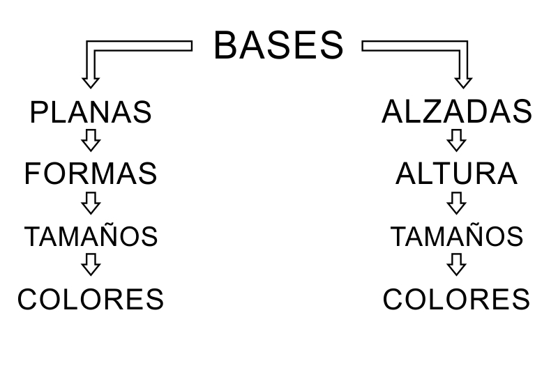

# PlaquiSystem

## Sistema de toma de pedidos

___

### Introducción

La idea de crear un sistema surje de la premisa de que cualquiera puede ocupar cualquier lugar con un minimo de entrenamiento.  
Un sistema brinda un apoyo para los empleados actuales y futuros.
Una automatización para reducir el margen de error en pedidos, en decisiones y maximizar productividad, control y métricas. 

El sistema está dividido (por el momento) en 3 partes.

* Parte 1: Una parte para tomar pedidos, usado por el empleado que también responde y atiende consultas al público.
* Parte 2: Una parte para administrar los pedidos que fueron tomados y controlar la fabricación de ellos.
* parte 3: Una parte en la que los clientes puedas realizar sus pedidos. 

### Indice:

1. [El camino del pedido](#el-camino-del-pedido)
2. [Parte 1: Sistema de toma de pedidos](#parte-1-sistema-de-toma-de-pedidos-empresa)
3. [Parte 2: Sistema de fabricación](#parte-2-sistema-de-fabricación-sap-empresa)
4. [Parte 3: Autogestión del pedido](#parte-3-autogestión-de-pedidos-clientes)
5. [Desarrollo](#desarrollo)
6. [To-Do](#to-do)

### El camino del pedido

Un pedido pasa por muchos estadios, pero los principales son: 

Paso | Pedido  |   Estado del pedido
-- | -- | --
1 | Entra el cliente | -
2 | el cliente elije | en proceso
2.1 | El cliente tiene que señar | pendiente de pago
3 | cliente paga | pedido hecho ( seña / total )
4 | el pedido se imprime | pedido hecho
5 | el pedido se agenda | pedido agendado
6 | el pedido se comienza a fabricar | en fabricación (nombre de diseñador)
7 | hay que pedir o preguntar algo | en espera
8 | pedido completo | para limpiar
9 | se pasa a deposito | para limpiar
10 | se limpia el pedido | para entregar
11 | se avisa al cliente | para entregar / avisado
11.1 | antes de entregar se revisa si está pago o no
12 | el cliente lo pasa a retirar | entregado 
    
Extras: 

* El pedido es para enviar con OCA
* El pedido es para envíar con Cadete
* Se especifica cómo se retira el pedido

#### Presentación de pedido

El pedido se presenta en forma similar al S.A.P. en formas de tarjetas con los datos.

* Parte 1: En forma de tarjeta

### Parte 1: Sistema de toma de pedidos (Empresa)

a desarrollar:

#### División: 

##### Tomar pedidos:

##### Revisar pedidos:

##### Modificar pedidos:

##### Venta en local (POS):

##### Clientes

tomar pedido
crear estado pendiente/agendado
imprimir ticket
enviar pedido al taller
tomar el pedido fabricado
tener nuevos estados: Avisado, entregado (se puede poner un numero de seguimiento)

### Parte 2: Sistema de Fabricación (SAP) (Empresa)

a desarrollar:

#### División: 

##### Recepción de pedidos:

Vista de todos los pedidos por fecha

##### Vista de pedidos por fecha

##### Vista de productos totales

##### Clientes

##### Logos de pedidos

tomar pedido de ventas
poder marcar items
estados de pedido: pendiente, fabricando, listo

###  Parte 3: Autogestión de pedidos (Clientes)

a desarrollar:

#### División

##### Ingreso de pedidos

##### Seguimiento de pedido

## Desarrollo 
### Estructura de datos

La estructura de datos va a ser plasmada en una base de datos (BDD) no relacional.

#### Productos

Los productos se dividen en 2 lineas: Bases y ToppersCake. 

Catalogos de productos:

https://bit.ly/plaqui

##### Linea 1: Bases

Hay 2 tipos de bases, planas y alzadas. Las planas no dependen de un pie para sostenerse, las alzadas si. 

Las bases planas se fabrican en diferentes formas: Flor, Sol, Redondas, Gota, Cuadradas y Vintages. Además cada base se puede hacer de un color y tamaño diferente

#### Pedido

#### Estaciones

#### Usuarios

#### Productos

### Especificaciones

El sistema va a poder usarse en diversos dispositivos, por lo que es preferible que sea Mobile First

#### Tecnologías 

FrontEnd: React + Material UI + SaSS
BackEnd: Firebase
 * Database: Firebase Realtime Database
 * Usuarios: Firebase Auth
 * Analitycs: Firebase Analitycs

Impresora termica

### To-Do

 - [ ] Documentación
 - [x] Indice
 - [ ] Bocetar interfaces
 - [ ] Estructurar datos en BDD